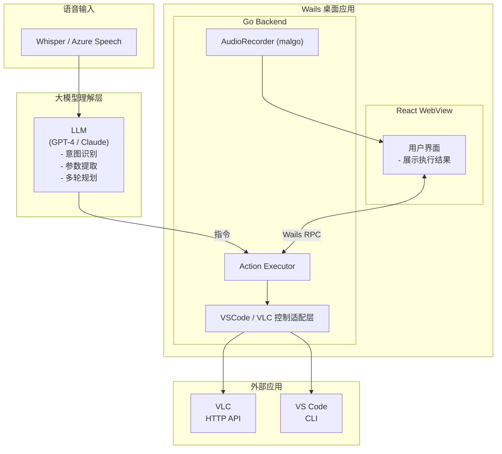

这是一个很有趣的项目！对于基于大模型的语音控制桌面应用，我来分析一下架构选择：

---

## 🏗️ 完整架构建议

```mermaid
flowchart TB
    subgraph Speech[语音输入]
        STT["Whisper / Azure Speech"]
    end

    subgraph LLM[大模型理解层]
        GPT["LLM<br/>(GPT-4 / Claude)<br/>- 意图识别<br/>- 参数提取<br/>- 多轮规划"]
    end

    subgraph Wails[Wails 桌面应用]
        subgraph UI[React WebView]
            View["用户界面<br/>- 展示执行结果"]
        end

        subgraph Backend[Go Backend]
            Executor["Action Executor"]
            Recorder["AudioRecorder (malgo)"]
            Adapter["VSCode / VLC 控制适配层"]
        end
    end

    subgraph Clients[外部应用]
        VLC["VLC<br/>HTTP API"]
        VSCode["VS Code<br/>CLI"]
    end

    STT --> GPT
    GPT -- 指令 --> Executor
    View <-->|Wails RPC| Executor
    Executor --> Adapter
    Adapter --> VLC
    Adapter --> VSCode
    Recorder --> View
```
