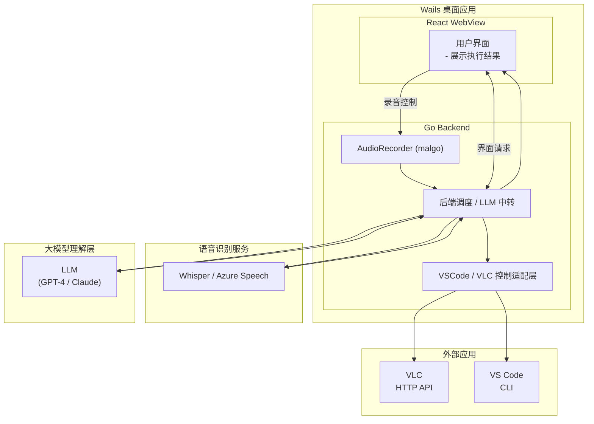

这是一个很有趣的项目！对于基于大模型的语音控制桌面应用，我来分析一下架构选择：

---

## 🏗️ 完整架构建议

```mermaid
flowchart TB
    subgraph Wails[Wails 桌面应用]
        subgraph UI[React WebView]
            View["用户界面<br/>- 展示执行结果"]
        end

        subgraph Backend[Go Backend]
            Recorder["AudioRecorder (malgo)"]
            Relay["后端调度 / LLM 中转"]
            Adapter["VSCode / VLC 控制适配层"]
        end
    end

    subgraph STTService[语音识别服务]
        STT["Whisper / Azure Speech"]
    end

    subgraph LLM[大模型理解层]
        GPT["LLM<br/>(GPT-4 / Claude)"]
    end

    subgraph Clients[外部应用]
        VLC["VLC<br/>HTTP API"]
        VSCode["VS Code<br/>CLI"]
    end

    View -->|录音控制| Recorder
    Recorder --> Relay
    Relay --> STT
    STT --> Relay
    Relay --> GPT
    GPT --> Relay

    View <-->|界面请求| Relay
    Relay --> Adapter
    Adapter --> VLC
    Adapter --> VSCode
    Relay --> View
```
