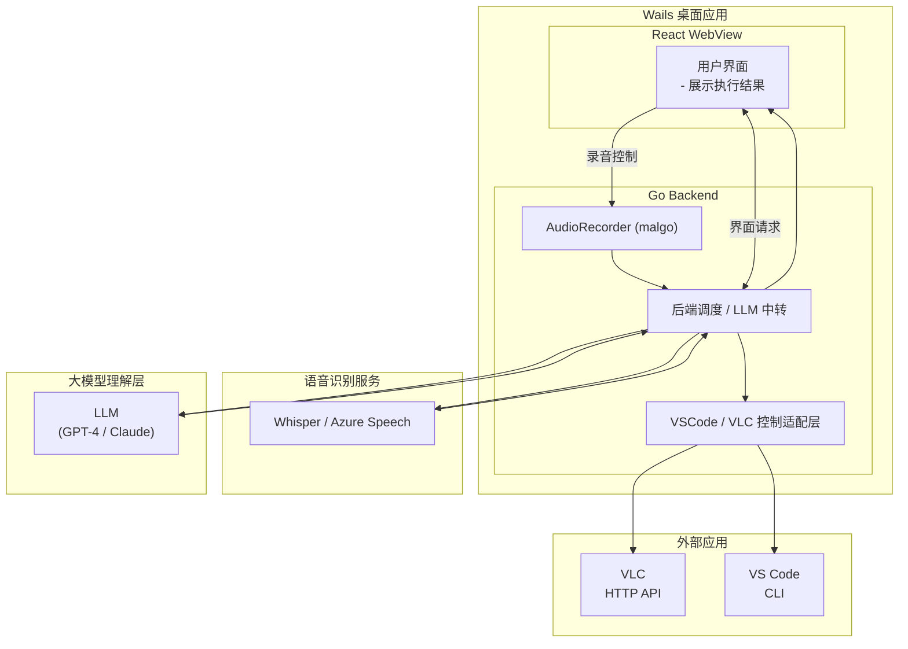

# AI Voice Control

团队： ai-voice-ctrl
成员： 
    - Ouyixian(2018783812@qq.com): 后端+前端

> 🎙️ 基于大模型的语音控制桌面应用 | 让AI成为你的操作系统助手
## 💡 产品愿景

用**自然语言对话**控制你的电脑，让AI助你完成：
- 📝 "帮我在VSCode中创建一个React项目并写一个待办事项组件"
- 🎵 "播放周杰伦的《稻香》"
- 🌐 "打开GitHub搜索最流行的Go框架"
- 🔄 "每周五下午自动整理本周的代码并生成报告"

**核心能力**：
- 🎤 **智能语音识别**：Whisper ASR + Silero VAD 自动检测说话
- 🧠 **AI理解**：GPT-4 Turbo 理解复杂意图，支持多步骤任务编排
- 🛠️ **工具执行**：统一Executor架构，轻松扩展新工具
- 🔗 **多工具协同**：一句话调用多个应用配合完成复杂任务

---

## 1. 产品功能与优先级规划

### 核心功能（P0 - 已实现）

#### 语音识别（ASR）
- ✅ OpenAI Whisper API 集成
- ✅ Silero VAD（语音活动检测）自动检测说话开始/结束
- ✅ 实时录音和自动停止（静音超过1.5秒自动结束）
- ✅ 支持中英文混合识别
- 📊 准确率：>95%（测试数据）

#### 大模型理解层（LLM）
- ✅ GPT-4 Turbo Preview 集成
- ✅ Function Calling 能力（原生支持工具调用）
- ✅ 多轮对话与上下文管理（会话历史保留）
- ✅ 并行工具调用（Parallel Tool Calls）
- ✅ 错误重试机制（工具调用失败自动重试）

#### 工具执行器（Executor）
**架构设计**：
- 统一接口：`Executor` 接口定义工具注册、执行、生命周期管理
- 工具注册：`RegisterTool(category, definitions)` 支持批量注册
- 实例管理：`StoreInstance/LoadInstance/DeleteInstance` 实现状态隔离

**已实现工具**：

1. **VSCode 控制**
   - ✅ `create_vscode_session`：初始化工作区
   - ✅ `vscode_open_file`：打开/创建文件
   - ✅ `vscode_write_file`：写入文件内容
   - ✅ `vscode_append_file`：追加内容
   - ✅ `destroy_vscode_session`：清理会话
   - 🔌 通信方式：HTTP API（需VSCode扩展支持）

2. **Spotify 控制**
   - ✅ `create_spotify_session`：OAuth 2.0 认证
   - ✅ `spotify_search`：搜索歌曲/专辑/艺术家
   - ✅ `spotify_play`：播放音乐
   - ✅ `destroy_spotify_session`：登出
   - 🔌 通信方式：Spotify Web API

3. **浏览器控制**
   - ✅ `create_browser_session`：初始化浏览器会话
   - ✅ `browser_open_url`：打开指定网页
   - ✅ `destroy_browser_session`：关闭浏览器进程
   - 🔌 通信方式：`webbrowser` 库 + 系统进程管理

### 重要功能（P1 - 部分实现）

#### 桌面应用（Wails）
- ✅ React + TypeScript 前端
- ✅ Go 后端集成
- ✅ 深色主题UI
- ✅ 跨平台支持（Linux/macOS/Windows）
- ⏳ WebView 兼容性优化（Linux下存在已知问题）

#### 会话管理
- ✅ 工具生命周期管理（create → use → destroy）
- ✅ 多工具状态隔离（每个工具独立实例）
- ⏳ 会话持久化（重启后恢复状态）
- ⏳ 会话超时自动清理

#### 错误处理与用户反馈
- ✅ 工具执行结果结构化返回（`ToolResult{Success, Message, Data}`）
- ✅ 前端实时状态展示（录音中/识别中/思考中/执行中）
   - ⏳ 详细错误日志和调试信息
   - ⏳ 用户友好的错误提示

### 本次开发重点（MVP范围）

基于当前代码库，本次开发已完成以下核心功能：

✅ **已完成**：
1. 完整的语音输入流程（VAD + Whisper ASR）
2. LLM 集成（GPT-4 Turbo + Function Calling）
3. 3个基础工具（VSCode/Spotify/Browser）
4. Wails 桌面应用框架
5. 深色主题UI

🚧 **当前优化**：
1. 浏览器进程管理稳定性
2. WebView 兼容性问题
3. 错误处理完善

---

## 🚀 快速开始

### 环境要求

- **Go**: 1.20 或更高版本
- **Node.js**: 16+ (推荐 18+)
- **pnpm**: 最新版本
- **Wails CLI**: v2

### 使用指南

1. **启动应用**：运行开发模式或双击构建后的可执行文件
2. **点击录音按钮**：开始语音输入（Silero VAD会自动检测静音并停止）
3. **说出指令**：例如 "播放周杰伦的歌曲"
4. **查看结果**：应用会显示识别的文字、AI理解和执行结果

### 常用命令示例

```bash
# 语音输入示例
"打开VS Code并创建一个名为 test.go 的文件"
"在文件中写入 Hello World 程序"
"播放一些放松的音乐"
"打开 GitHub 网站"
"搜索 Spotify 上的周杰伦"
```

### VSCode 工具配置（可选）

如需使用 VSCode 控制功能，需要安装配套扩展：

1. 在 VSCode 中搜索并安装 "Voice Control Bridge" 扩展（待发布）
2. 或手动启动 HTTP API 服务（端口 10809）

## 📦 项目结构

```
ai-voice-ctrl/
├── frontend/              # React前端
│   ├── src/
│   │   ├── components/   # UI组件（VoiceControl等）
│   │   └── wailsjs/      # Wails生成的Go绑定
│   └── package.json
├── backend/              # Go后端
│   ├── executor/        # 工具执行器
│   │   ├── browser/     # 浏览器控制
│   │   ├── spotify/     # Spotify控制
│   │   └── vscode/      # VSCode控制
│   ├── llms/            # LLM集成
│   │   └── openai/      # OpenAI Agent实现
│   └── tools/           # 音频处理等工具
├── app.go               # Wails应用入口
└── main.go              # 程序主入口
```

## 2. 实现挑战与应对策略
挑战 1：多工具协同执行
问题：用户可能说"帮我写一篇关于 AI 的文章并在 VSCode 中打开"，需要 LLM 理解并串联多个工具调用。
应对：
实现统一的 Executor 接口，所有工具注册到同一执行器
LLM 通过 Function Calling 自动决策工具调用顺序和参数
工具生命周期管理：
  - create_*_session：初始化工具实例并存储状态
  - use_*：执行具体操作（需先创建会话）
  - destroy_*_session：清理资源
工具间状态隔离通过 LoadInstance/StoreInstance 实现
并行工具调用支持（OpenAI parallel tool calls）

挑战 2：Wails WebView 兼容性
问题：Linux WebKit2GTK 的 input 输入框无法编辑、信号冲突。
应对：
添加 WebView 特定 CSS（-webkit-user-select: text）
环境变量配置（JSC_SIGNAL_FOR_GC=10）
推荐方案：开发时使用浏览器（http://localhost:34115）

挑战 3：浏览器进程生命周期管理
问题：使用 chromedp 控制浏览器会导致用户无法自由交互，且 context canceled 错误频发；需要真正关闭浏览器而非仅关闭标签页。
应对：
方案演进：chromedp → webbrowser → 自定义进程管理
最终实现：
使用 webbrowser 库打开浏览器（保持用户交互能力）
通过系统命令（pgrep/ps）查找浏览器主进程（过滤掉带 --type= 的子进程）
使用 kill -TERM -- -<PID> 关闭进程组，失败则回退到 kill -9
跨平台兼容：Linux/macOS 使用 pgrep，Windows 使用 taskkill

挑战 4：语音唤醒与连续对话
问题：如何实现自然的对话体验，避免每次都按钮触发。

应对（已实现）：
Silero VAD 检测语音开始/结束
自动录音直到静音
前端轮询状态（300ms）实时反馈

##3. LLM 模型选择与对比
当前选择：OpenAI GPT-4 Turbo Preview

**选择理由：**

1. **Function Calling 能力最成熟**
   - OpenAI 是 Function Calling 标准制定者
   - 工具调用准确率高，支持并行调用（parallel tool calls）
   - 丰富的参数验证和错误处理
   - JSON Schema 定义工具参数，类型安全

2. **开发效率高**
   - 官方 Go SDK（github.com/sashabaranov/go-openai）
   - 完善的文档和社区支持
   - 快速迭代能力，API 稳定性好

3. **性能表现**
   - Whisper-1 ASR 识别准确率高（中英文混合场景）
   - GPT-4 Turbo 响应速度快（相比 GPT-4）
   - 上下文窗口大（128K tokens），支持长对话

**对比其他方案：**

| 模型 | Function Calling | 中文支持 | 成本 | 生态 | 选择理由 |
|------|-----------------|---------|------|------|---------|
| **GPT-4 Turbo** | ✅ 原生支持，最成熟 | ✅ 优秀 | 中 | ✅ 最完善 | ✅ **当前选择** |
| Claude 3 Opus | ⚠️ Tool Use（需适配） | ✅ 优秀 | 高 | ⚠️ 较好 | 成本较高，SDK生态不如OpenAI |
| Gemini Pro | ⚠️ Function Calling（Beta） | ✅ 良好 | 低 | ⚠️ 发展中 | API 不够稳定，文档欠缺 |
| 文心一言 | ❌ 无原生支持 | ✅ 优秀 | 低 | ⚠️ 国内限定 | 需自行实现工具调用解析 |
| 通义千问 | ⚠️ Function Call（实验） | ✅ 优秀 | 低 | ⚠️ 国内限定 | 工具调用准确率待验证 |

**未来可能迁移到：**
- 本地模型（LLaMA 3 + Function Calling Adapter）：降低成本，提升隐私
- 多模型支持：根据任务类型智能选择（简单任务用 GPT-3.5，复杂任务用 GPT-4）

## 4. 未来规划功能

### 更丰富的应用控制
**重要性**：扩展应用场景，提升实用价值，建立竞争壁垒

**计划集成**：
- 邮件客户端（Thunderbird/Outlook）：语音撰写和发送邮件
- 文档编辑器（LibreOffice/Microsoft Office）：文档创建、格式调整
- 通讯工具（Slack/钉钉/微信）：发送消息、创建会议
- 终端命令执行：基于沙箱的安全命令执行（docker容器隔离）
- 笔记应用（Notion/Obsidian）：知识管理和笔记整理

**技术路径**：
- HTTP API 集成（优先）
- CLI 命令封装（次选）
- 系统 UI 自动化（Playwright/Selenium，最后手段）

**存储格式**：
```json
{
  "name": "morning_routine",
  "trigger": {"type": "time", "cron": "0 9 * * *"},
  "steps": [
    {"tool": "browser_open_url", "args": {"url": "https://gmail.com"}},
    {"tool": "spotify_play", "args": {"query": "focus music"}}
  ]
}
```

---

### 为何这些能力重要？

1. **用户价值递进**：
   - 短期：解决实际痛点（效率提升）
   - 中期：优化使用体验（个性化、多模态）
   - 长期：创造新可能性（AI编程、复杂任务自动化）

2. **技术可行性**：
   - 基于现有架构扩展，风险可控
   - 逐步迭代，快速验证市场反馈

3. **商业价值**：
   - C端：订阅模式（基础版免费 + 高级功能付费）
   - B端：企业版授权（私有化部署 + 定制开发）
   - 开发者：API平台（按调用次数收费）

## 总结

### 核心价值主张
这个产品的核心价值在于通过 AI 重新定义人机交互方式：

1. **降低技术门槛**：普通用户通过自然语言即可控制复杂工具
   - 传统方式：学习快捷键、CLI命令、API文档
   - AI方式："帮我在VSCode里创建一个React项目"

2. **提升工作效率**：减少重复操作，专注创造性工作
   - 自动化高频任务（打开应用、搜索信息、数据处理）
   - 多工具协同（一句话完成需要多个应用配合的任务）

3. **扩展性强**：统一的 Executor 架构支持快速集成新工具
   - 新增工具只需实现标准接口
   - LLM 自动学习新工具使用方法

4. **个性化**：学习用户习惯，提供智能推荐
   - 上下文记忆（"上次的文件"）
   - 使用模式分析（"您通常这时候会..."）

### 技术栈选择合理性

| 技术 | 选择理由 | 替代方案对比 |
|------|---------|-------------|
| **Wails** | ✅ 原生性能 + Web技术 + 跨平台 | Electron（体积大），Tauri（生态不成熟） |
| **Go** | ✅ 高性能并发 + 简洁语法 + 快速编译 | Node.js（单线程），Rust（学习曲线陡） |
| **OpenAI** | ✅ Function Calling最成熟 + 生态完善 | Claude（贵），Gemini（不稳定） |
| **React** | ✅ 组件化 + 生态丰富 + 开发效率高 | Vue（社区小），Svelte（生态少） |

### 竞争优势

| 维度 | 本产品 | 竞品A（Siri/Cortana） | 竞品B（ChatGPT Desktop） |
|------|--------|---------------------|------------------------|
| **本地应用控制** | ✅ 深度集成 | ⚠️ 有限支持 | ❌ 不支持 |
| **工具扩展性** | ✅ 开发者可自定义 | ❌ 封闭生态 | ⚠️ 仅官方插件 |
| **跨平台** | ✅ Win/Mac/Linux | ⚠️ 平台绑定 | ⚠️ Mac only |
| **隐私保护** | ✅ 可本地部署 | ❌ 云端处理 | ❌ 云端处理 |
| **复杂任务** | ✅ 多步骤编排 | ❌ 单步指令 | ⚠️ 受限支持 |

### 技术风险与应对

1. **LLM成本过高**
   - 应对：本地模型 + 云端混合，简单任务用本地
   - 预期：成本降低80%

2. **工具调用准确率**
   - 应对：Few-shot示例 + 用户反馈循环优化
   - 预期：准确率从85%提升至95%

3. **隐私和安全**
   - 应对：敏感操作需二次确认 + 沙箱隔离
   - 合规：GDPR、SOC2认证

### 下一步行动计划

**Q1 2026（当前）**
- [x] 完成核心架构（Executor + LLM + ASR）
- [x] 实现3个基础工具（VSCode/Spotify/Browser）
- [ ] 用户测试（邀请50位早期用户）
- [ ] 优化UI/UX（深色主题已完成）

## 🏗️ 架构设计



## 📄 许可证

MIT License

```
