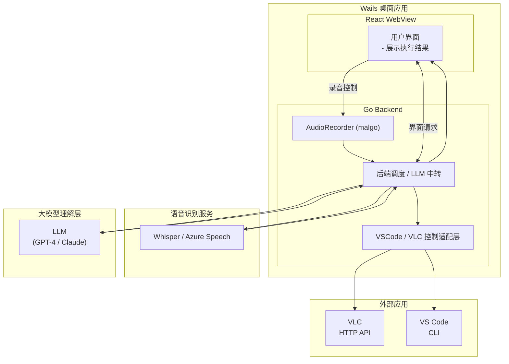

# AI Voice Control

> AI驱动的桌面应用语音控制系统，使用 Wails + Go + React 构建

## 1. 产品功能与优先级规划
核心功能（P0 - 已实现）：
语音识别（ASR）

使用 OpenAI Whisper API
集成 Silero VAD（语音活动检测）
支持实时录音和自动停止
大模型理解层（LLM）

GPT-4 Turbo Preview
Function Calling 能力
多轮对话与上下文管理
工具执行器（Executor）

VSCode 控制：创建工作区、打开/编辑/追加文件
Spotify 控制：OAuth 认证、搜索歌曲、播放控制
浏览器控制：打开网页、关闭浏览器进程
重要功能（P1 - 部分实现）：
桌面应用（Wails）

React + TypeScript 前端
Go 后端集成
跨平台支持（Linux/macOS/Windows）
会话管理

工具生命周期管理（create → use → destroy）
多工具状态隔离
增强功能（P2 - 规划中）：
更丰富的工具集成
文件系统操作
系统命令执行
更多应用控制

## 📦 项目结构

```
ai-voice-ctrl/
├── frontend/              # React前端
│   ├── src/
│   │   ├── components/   # UI组件（VoiceControl等）
│   │   └── wailsjs/      # Wails生成的Go绑定
│   └── package.json
├── backend/              # Go后端
│   ├── executor/        # 工具执行器
│   │   ├── browser/     # 浏览器控制
│   │   ├── spotify/     # Spotify控制
│   │   └── vscode/      # VSCode控制
│   ├── llms/            # LLM集成
│   │   └── openai/      # OpenAI Agent实现
│   └── tools/           # 音频处理等工具
├── app.go               # Wails应用入口
└── main.go              # 程序主入口
```

## 2. 实现挑战与应对策略
挑战 1：多工具协同执行
问题：用户可能说"帮我写一篇关于 AI 的文章并在 VSCode 中打开"，需要 LLM 理解并串联多个工具调用。
应对：
实现 Executor 统一接口，所有工具注册到同一执行器
LLM 自动决策工具调用顺序（Function Calling）
工具间状态隔离通过 LoadInstance/StoreInstance 实现

挑战 2：Wails WebView 兼容性
问题：Linux WebKit2GTK 的 input 输入框无法编辑、信号冲突。
应对：
添加 WebView 特定 CSS（-webkit-user-select: text）
环境变量配置（JSC_SIGNAL_FOR_GC=10）
推荐方案：开发时使用浏览器（http://localhost:34115）

挑战 4：语音唤醒与连续对话
问题：如何实现自然的对话体验，避免每次都按钮触发。

应对（已实现）：
Silero VAD 检测语音开始/结束
自动录音直到静音
前端轮询状态（300ms）实时反馈

##3. LLM 模型选择与对比
当前选择：OpenAI GPT-4 Turbo Preview
选择理由：

Function Calling 能力最成熟

OpenAI 是 Function Calling 标准制定者
工具调用准确率高，支持并行调用
丰富的参数验证和错误处理
开发效率高

官方 Go SDK（github.com/sashabaranov/go-openai）
完善的文档和社区支持
快速迭代能力
性能表现

Whisper-1 ASR 识别准确率高（中英文混合场景）
GPT-4 Turbo 响应速度快（相比 GPT-4）
上下文窗口大（128K tokens）

## 4. 未来规划功能
更丰富的应用控制 ⭐⭐⭐⭐⭐

重要性：扩展应用场景，提升实用价值
计划集成：
邮件客户端（Thunderbird/Outlook）
文档编辑器（LibreOffice/Microsoft Office）
通讯工具（Slack/钉钉）
终端命令执行（安全沙箱）
本地语音识别 ⭐⭐⭐⭐

重要性：降低延迟和成本，提升隐私保护
技术方案：
集成 Whisper.cpp（本地推理）
Silero VAD + FunASR（阿里达摩院）
支持离线工作模式
自定义工作流 ⭐⭐⭐⭐

重要性：提升高频场景效率
功能设计：
宏录制（记录一系列操作）
条件触发（时间/事件触发）
参数化工作流（模板化）

## 总结
这个产品的核心价值在于：

降低技术门槛：普通用户也能通过自然语言控制复杂工具
提升效率：减少重复操作，专注创造性工作
扩展性强：统一的 Executor 架构支持快速集成新工具
技术栈选择合理性：

✅ Wails 提供跨平台能力
✅ Go 保证性能和并发
✅ OpenAI 提供最佳 AI 能力
✅ 模块化设计便于扩展
商业化潜力：

B端：企业自动化办公
C端：个人效率工具
开发者：可编程接口平台

## 🏗️ 架构设计



## 🎯 支持的工具

### VSCode 控制
- 打开/创建文件
- 写入/追加内容
- 执行命令
- 通过HTTP API与VSCode扩展通信

### Spotify 控制
- OAuth 2.0认证
- 搜索歌曲/专辑/歌手
- 播放/暂停/切歌
- 播放列表管理

### 浏览器控制
- 打开指定URL
- 进程生命周期管理
- 跨平台进程查找和关闭
- 支持Chrome/Chromium系列浏览器

## 🔧 技术栈

**前端**
- React 18
- TypeScript
- Vite
- CSS Modules

**后端**
- Go 1.20+
- Wails v2
- OpenAI Go SDK
- Spotify Web API

**AI服务**
- OpenAI GPT-4 Turbo Preview
- OpenAI Whisper ASR
- Function Calling

## 📝 使用示例

启动应用后，可以通过语音命令控制：

- "打开VS Code并创建一个新的Go文件"
- "播放周杰伦的歌曲"
- "打开GitHub网站"
- "搜索Spotify上的流行音乐"

## 📄 许可证

MIT License

```
